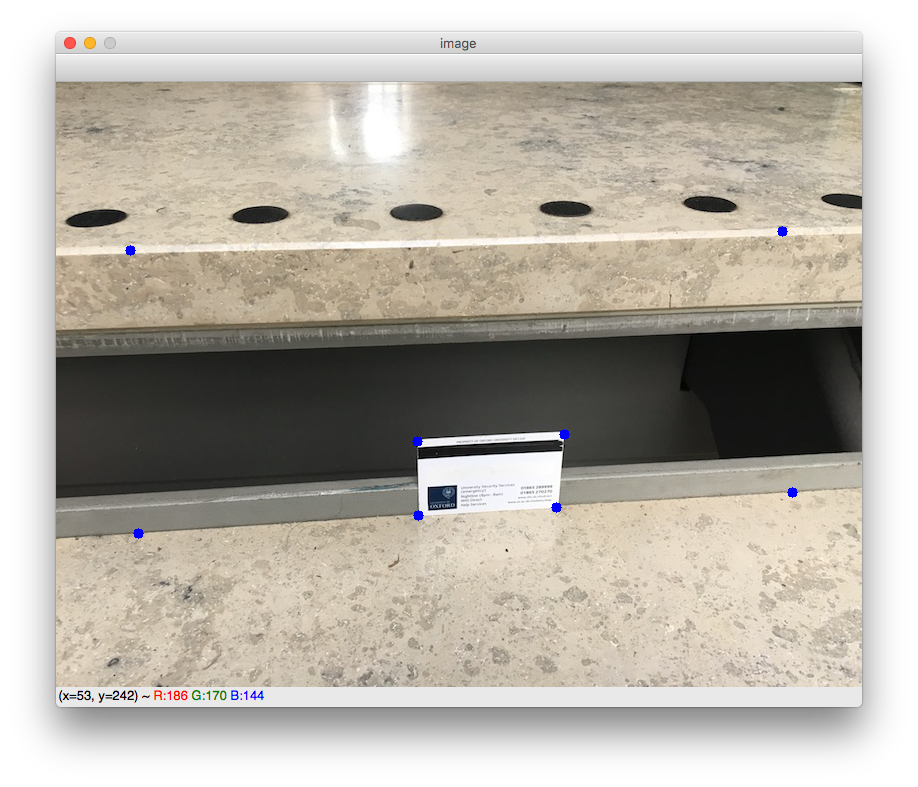
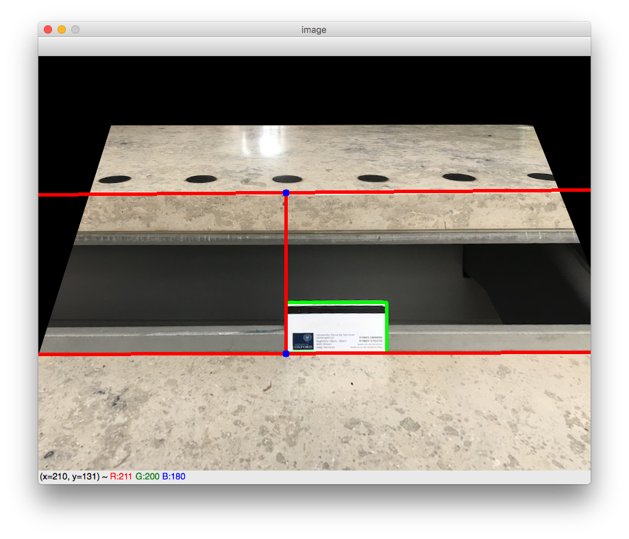

# Estimate step height

Python demo for estimating the height of a stair step for the [Oxford Accessibility Project](https://www.oxfordaccessibilityproject.org/).

1. Install dependencies (e.g., numpy, opencv-python) via pip: `pip install -r requirements.txt`

2. Run `python estimate_step_height.py IMG_PATH`, where `IMG_PATH` is an image of a stair step with a standard credit card in the parallel to the vertical of the step. For best results, take the image close up, so that the card is as big as possible.

A new window with your image will appear (it might not be the forefront window). On it, click on the following 8 points in order:
1. top left corner of card
2. top right corner of card
3. bottom right corner of card
4. bottom right corner of card
5. a far left point where the step begins (i.e., bottom edge)
6. a far right point where the step begins
7. a far left point where the step ends (i.e., top edge)
8. a far right poit where the step ends

8 points to click (in order):


Example program output:

```
$ python estimate_step_height.py images/stepA_1.jpg

Click the following 8 points in order:
A. Credit card (1., top left corner, 2., top right corner, 3. bottom right corner, 4., bottom left corner)
B. Bottom step (5., a leftmost point, 6., a rightmost point)
C. Top step (7., a leftmost point, 8., a rightmost point)

Press any key when finished clicking (press "r" to restart clicking).

Step height: 17.14 cm
```

Ground truth: stepA's height is around 17 cm.

Warped image:

